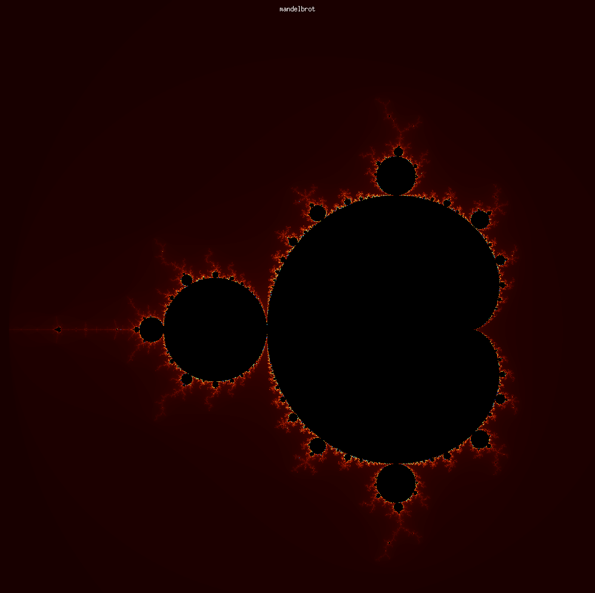
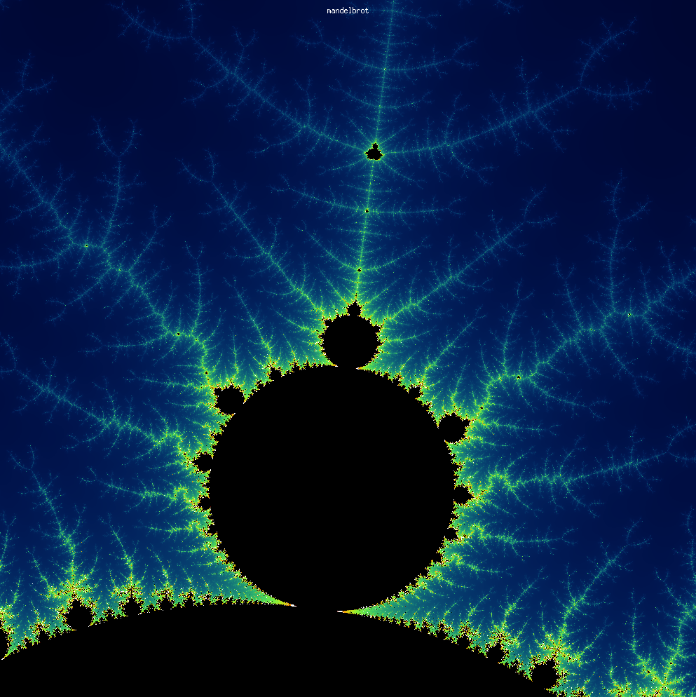
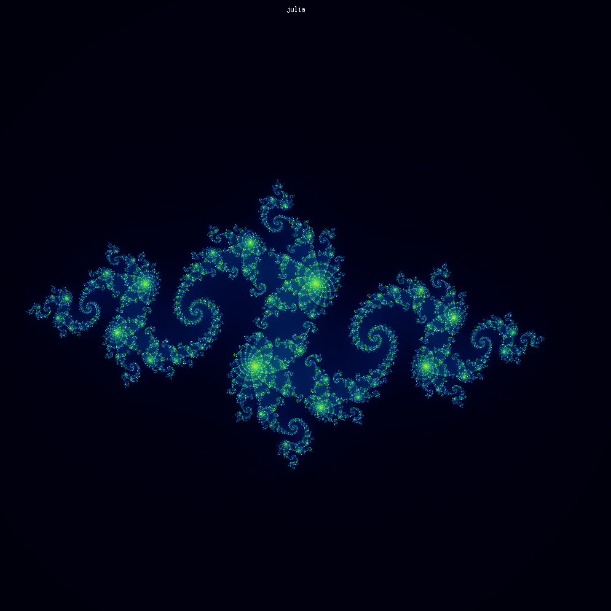
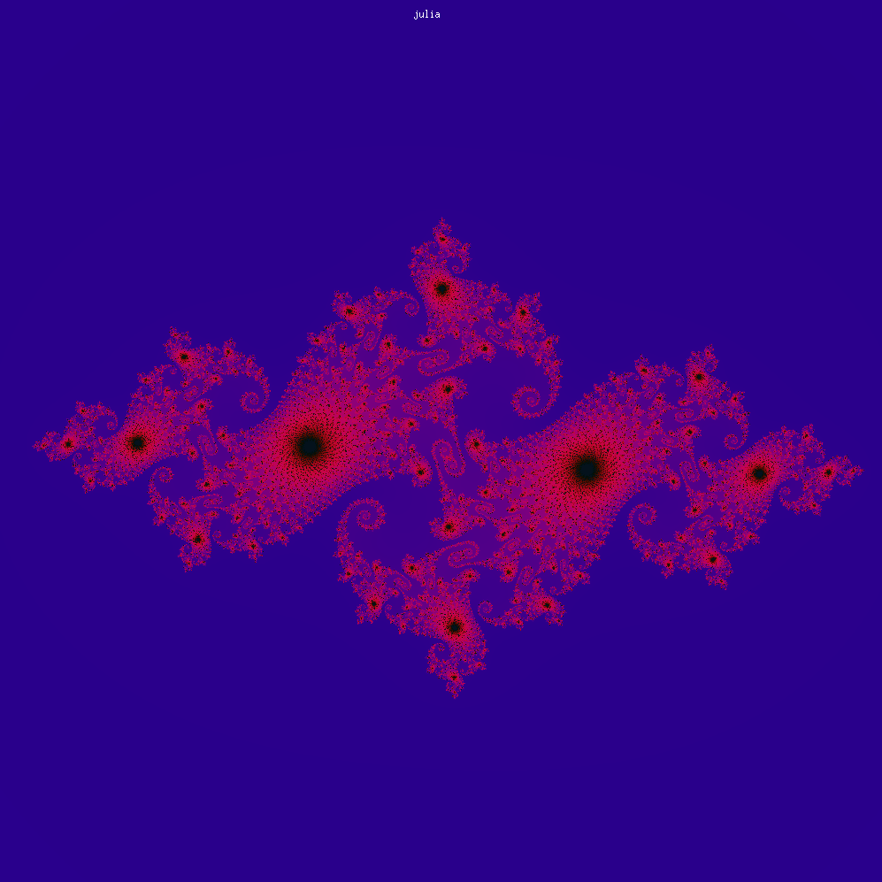
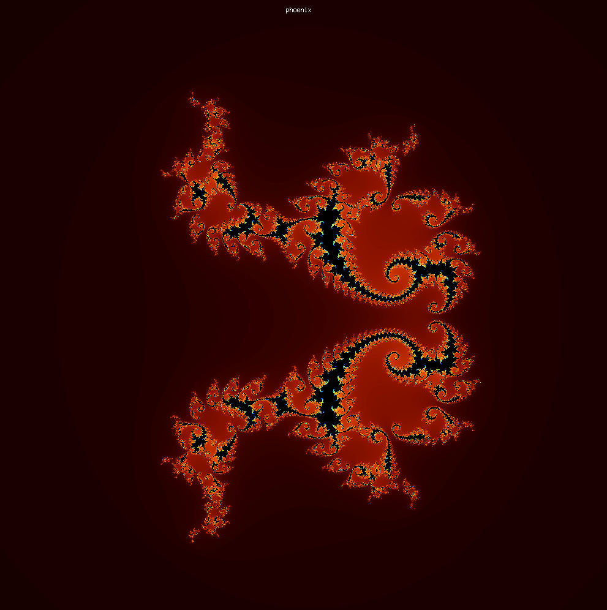
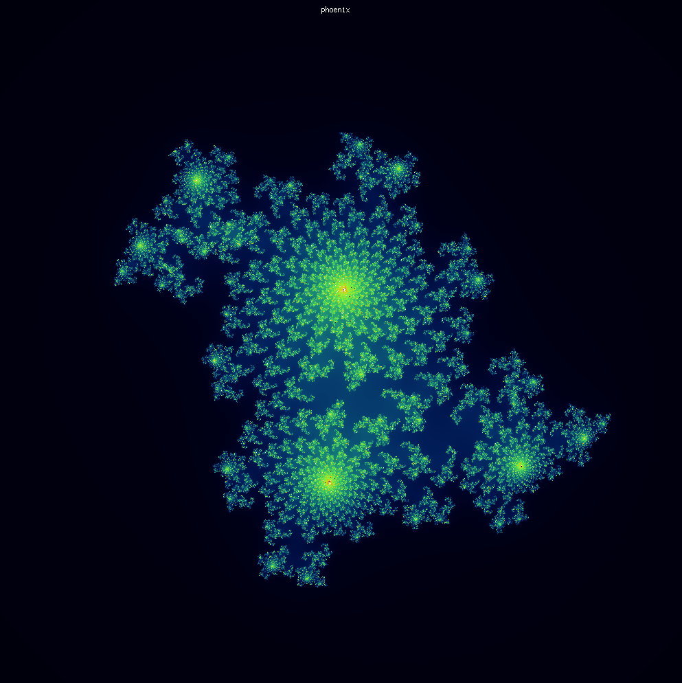

# 42_fract-ol

### Small Description
  - This project is a subtle introduction to the world of X Window System, for that we use the Minilibx from the 42 School. We aim to render fractals using only the CPU, without the aid of threads or the GPU.

### How are the Fractals Draw
  - We iterate over a function ($P(z) = z^2 + c$) and check if the point we started goes to infinity or stays bounded to the starting point. The color is based on how fast the point goes about the treshhold, which in our case if (| z | > 2). If it stays in a pattern close to the starting point, it belongs to the mandelbrot set and it's colored black.

### How to use and navigate the program
  - Simply git clone it, use `make mlx` to download the minilibx, then simply `make` to compile
  - Use the arrows to move
  - Use `w` or `s` to cycle between Julia and Phoenix sets
  - Use `a` or `d` to change colors
  - Use `m` or `j` or `p` to choose between Mandelbrot, Julia or Phoenix sets
  - Mouse scroll to zoom in or zoom out,
  - Mouse left and right click incerase and decrease the number of iterations
  - Mouse middle button resets the zoom

### Some of my results

